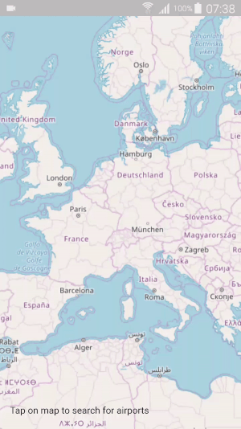

# Examples

## Dart examples

- **Functions**: shows how to use the basic functions
- **Stream**: shows how to use the streams to retrive data as soon as it is parsed
- **Geofencing from polygons**: find all the airports in a country
- **Geofencing from distance**: find all the airports within a given distance

## Flutter examples

- **Display polygons on a map**: parse a file and display polygons as soon as they are found
- **Display lines on a map**: parse a file and display lines as soon as they are found
- **Geofencing from polygons**: find all the airports in a country and display them on a map as soon as they are found
- **Geofencing from distance**: find all the airports within a given distance and display them on a map as soon as they are found

